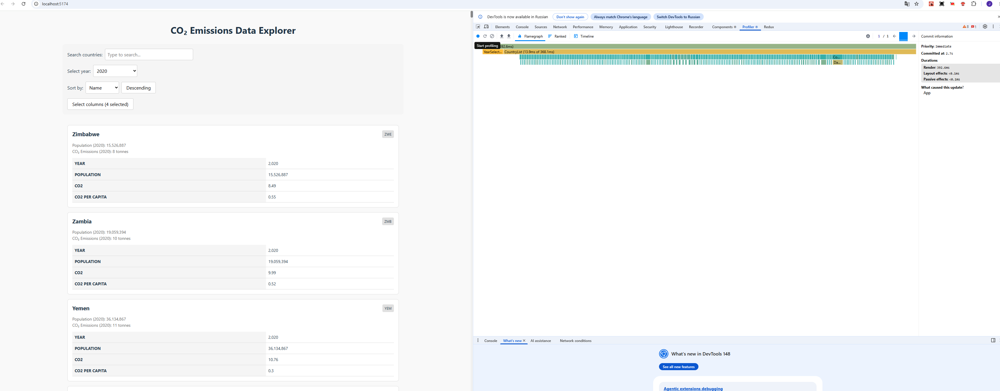
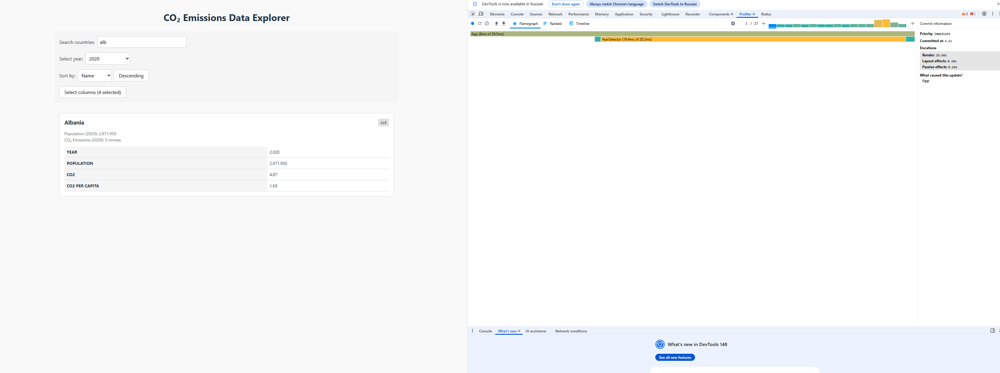
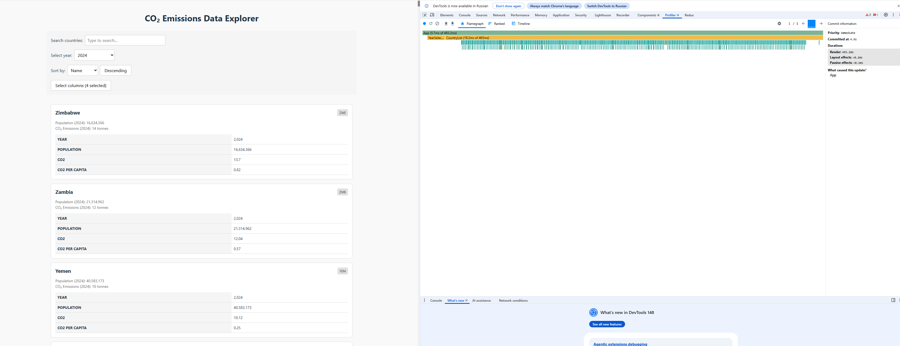
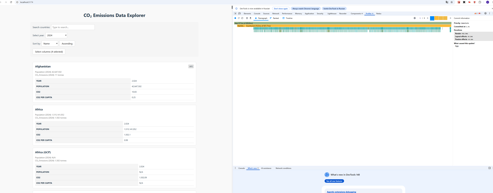
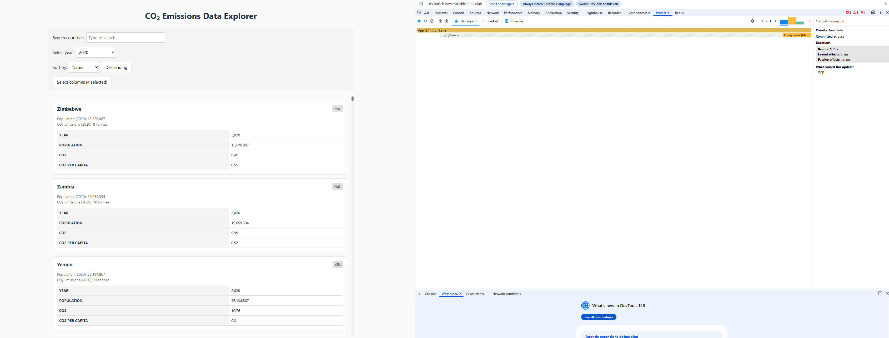
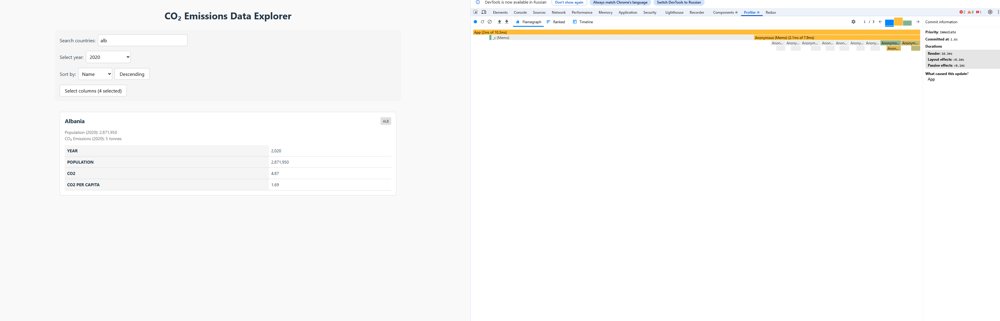
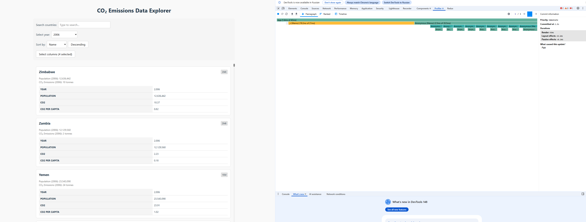
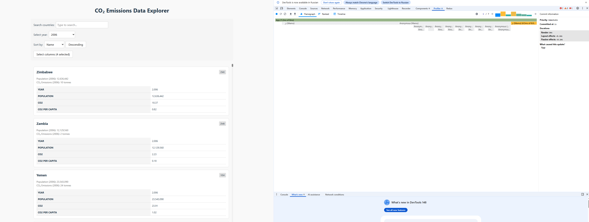

# Performance Optimization Report

## Baseline Measurements

### Interaction A: Sort countries

- **Commit duration**: 4.14 s
- **Render duration**: 450 ms
- **Screenshot**: 

### Interaction B: Search countries

- **Commit duration**: 4.23 s
- **Render duration**: 29 ms
- **Screenshot**: 

### Interaction C: Change year

- **Commit duration**: 6.99 s
- **Render duration**: 493 ms
- **Screenshot**: 

### Interaction D: Toggle column

- **Commit duration**: 4.17 s
- **Render duration**: 420 ms
- **Screenshot**: 

## Optimized Measurements

### Interaction A: Sort countries

- **Commit duration**: 1.4 s
- **Render duration**: 5 ms
- **Screenshot**: 

### Interaction B: Search countries

- **Commit duration**: 1.6 s
- **Render duration**: 10 ms
- **Screenshot**: 

### Interaction C: Change year

- **Commit duration**: 2.3 s
- **Render duration**: 43 ms
- **Screenshot**: 

### Interaction D: Toggle column

- **Commit duration**: 2.1 s
- **Render duration**: 8 ms
- **Screenshot**: 

## Summary of Improvements

| Interaction      | Baseline (ms) | Optimized (ms) | Improvement |
| ---------------- | ------------- | -------------- | ----------- |
| Sort countries   | 450           | 5              | 98.9%       |
| Search countries | 29            | 10             | 65.5%       |
| Change year      | 493           | 43             | 91.3%       |
| Toggle column    | 420           | 8              | 98.1%       |
| **Average**      | **348**       | **16.5**       | **95.3%**   |
